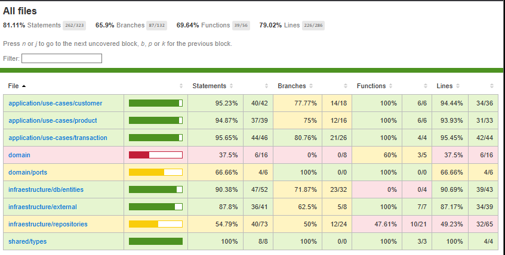
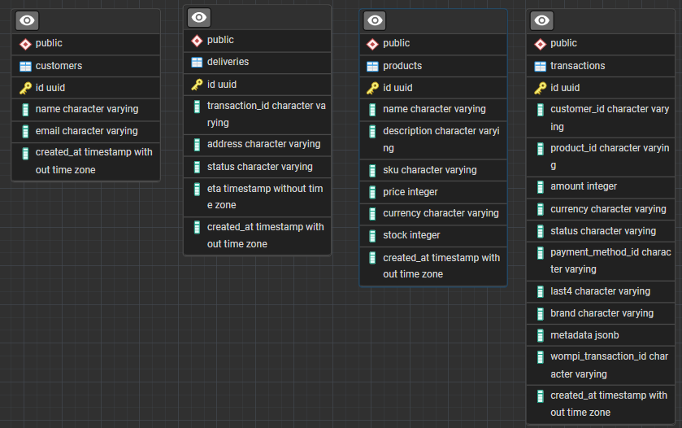

E-commerce Backend API
Una aplicación backend construida con Nest.js siguiendo principios de arquitectura hexagonal y programación orientada a ferrocarriles.

Arquitectura
Framework: Nest.js con TypeScript
Arquitectura: Hexagonal (Puertos y Adaptadores)
Patrón: Railway Oriented Programming (ROP)
Base de datos: PostgreSQL
ORM: TypeORM
URL productiva: http://52.91.53.76:3000/

## Description

[Nest](https://github.com/nestjs/nest) framework TypeScript starter repository.

## Project setup

```bash
$ npm install
```

## Compile and run the project

```bash
# development
$ npm run start

# watch mode
$ npm run start:dev

# production mode
$ npm run start:prod
```

## Run tests

```bash
# unit tests
$ npm run test

# e2e tests
$ npm run test:e2e

# test coverage
$ npm run test:cov

# up local data base
$ npm run docker:up

# down local data base
$ npm run docker:down
```

## Coverage



## E/R model


